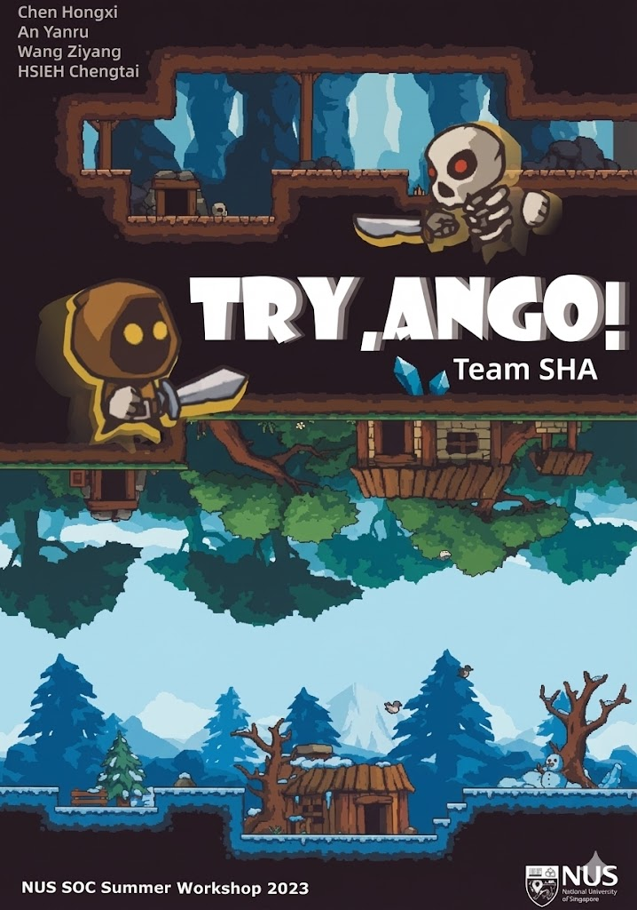

# Try ANGO  
2023 NUS Summer Workshop, ***Introduction to 2D Game Development***




### **[AN Yanru](https://github.com/POPAYR)** ｜ **[CHEN Hongxi](https://github.com/XiGabe?tab=repositories)** | **[HSIEH Cheng-Tai](https://github.com/HsiehTPE)** ｜ **WANG Ziyang**

### **[🏠 Course Homepage](https://html5gameenginegroup.github.io/GTCS-Engine-Student-Projects/2023.7.NUS/)** ｜ **[🎮 PLAY FINAL TEST](https://hsiehtpe.github.io/2023NUS_Project/6_FinalTest/FinalTest_WebGL)** ｜ **[🎬 TRAILER](https://b23.tv/G2fBbfd)**


## 📌 Project Introduction ｜项目简介

**Try ANGO** is a 2D game developed during the **2023 Summer Workshop NUS 2D Game Development Program**.  
The project is built using **Unity** and deployed via **WebGL**, allowing players to play directly in the browser without installation.

**Try ANGO** 是在 **2023 年新加坡国立大学（NUS）暑期工作坊 2D 游戏开发课程** 中完成的项目。  
本项目基于 **Unity 引擎** 开发，并通过 **WebGL** 部署，可直接在浏览器中运行，无需下载安装。


## ▶️ Play the Game (WebGL) ｜在线试玩（WebGL）

All builds are hosted on **GitHub Pages**.  
All links should be opened using a modern desktop browser (Chrome / Edge / Firefox).

所有版本均托管于 **GitHub Pages**，  
请使用现代桌面浏览器（Chrome / Edge / Firefox）打开。

### 🌐 URL Format ｜访问格式
```
https://hsiehtpe.github.io/2023NUS_Project/{Build_Folder}
```
### 🔹 Test Scene ｜WebGL测试
https://hsiehtpe.github.io/2023NUS_Project/test

### 🔹 Prototype ｜原型展示
https://github.com/HsiehTPE/2023NUS_Project/blob/main/2_DigitalPrototype/prototype.mp4

### 🔹 Rough Demo ｜初步演示版本
https://hsiehtpe.github.io/2023NUS_Project/3_RoughDemo/DemoWebGL

### 🔹 Alpha Test ｜Alpha 测试版
https://hsiehtpe.github.io/2023NUS_Project/4_AlphaTest/AlphaTest_WebGL

### 🔹 Beta Test ｜Beta 测试版
https://hsiehtpe.github.io/2023NUS_Project/5_BetaTest/beta_test_webgl

### 🔹 Final Version ｜最终版本
https://hsiehtpe.github.io/2023NUS_Project/6_FinalTest/FinalTest_WebGL


## 📂 Repository Structure ｜仓库结构说明

```
2023NUS_Project/
├─ test/
├─ 2_DigitalPrototype/
│  └─ prototype.mp4/
├─ 3_RoughDemo/
│  └─ DemoWebGL/
├─ 4_AlphaTest/
│  └─ AlphaTest_WebGL/
├─ 5_BetaTest/
│  └─ beta_test_webgl/
├─ 6_FinalTest/
│  └─ FinalTest_WebGL/
```

Each WebGL build folder contains:
- `index.html`
- `Build/`
- `TemplateData/`

每个 WebGL 文件夹均包含完整可运行的 Unity WebGL 构建文件。


## 📬 Contact | 联系

For questions or feedback, please contact:  

**HSIEH Cheng-Tai, hsiehtpe_sjtu@sjtu.edu.cn**  

## 🙏 Acknowledgements ｜致谢
This project was developed as part of the **NUS Summer School – 2D Game Development Program (2023)**.  
Special thanks to instructors Professor 	
Kelvin Sung and classmates for their guidance and feedback.

本项目完成于 **新加坡国立大学（NUS）2023 暑期 2D 游戏开发课程**。  
感谢课程导师	
Kelvin Sung教授 与同学在开发过程中给予的指导与建议。

© 2023 Try ANGO Project

---

